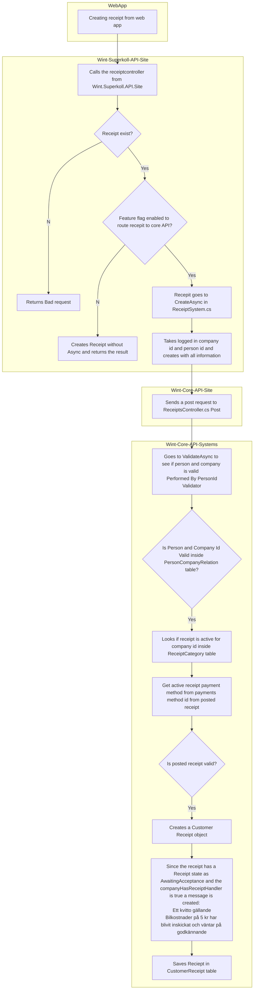
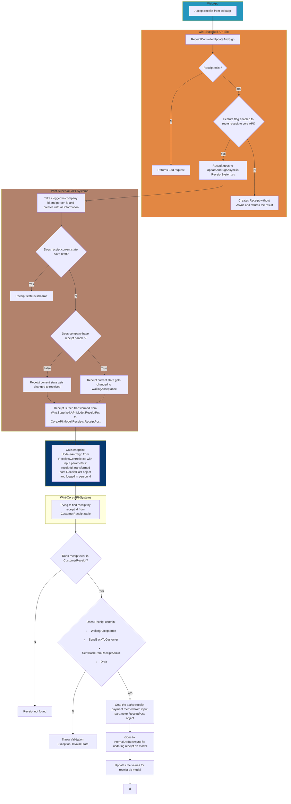

# When creating a receipt

```mermaid

graph TD

CreateReceiptFromWebApp[Creating receipt from web app] -->
ReceiptControllerCreatePost[Calls the receiptcontroller from Wint.Superkoll.API.Site]

ReceiptControllerCreatePost -->
ReceiptExist{Receipt exist?}

ReceiptExist --No-->
ReceiptBadRequest[Returns Bad request]

ReceiptExist --Yes-->
RouteToCore{Feature flag enabled to route recepit to core API?}

RouteToCore --Yes-->
CreateRecepitAsync[Recepit goes to CreateAsync in ReceiptSystem.cs]

RouteToCore--No-->
CreateReceipt[Creates Receipt without Async and returns the result]

CreateRecepitAsync -->
TakesLoggedInCompanyIdAndPersonId[Takes logged in company id and person id and creates with all information]

TakesLoggedInCompanyIdAndPersonId -->
ReceiptToCoreAPI[Sends a post request to ReceiptsController.cs Post]

ReceiptToCoreAPI -->
ReceiptCreate[Goes to ValidateAsync to see if person and company is valid <br/> Performed By PersonId Validator]

ReceiptCreate -->
PersonAndCompanyValid{Is Person and Company Id Valid inside PersonCompanyRelation table?}

PersonAndCompanyValid --Yes-->
LooksIfReceiptIsAvtiveForThatCompanyId[Looks if receipt is active for company id inside ReceiptCategory table]

LooksIfReceiptIsAvtiveForThatCompanyId-->
PaymentMethods[Get active receipt payment method from payments method id from posted receipt]

PaymentMethods -->
ReceiptPostValidator

ReceiptPostValidator{Is posted receipt valid?} --Yes-->
CreateACustomerReceiptObject[Creates a Customer Receipt object]

CreateACustomerReceiptObject-->
ReceiptDb[Since the receipt has a Receipt state as AwaitingAcceptance and the companyHasReceiptHandler is true a message is created: <br /> Ett kvitto gällande Bilkostnader på 5 kr har blivit inskickat och väntar på godkännande]

ReceiptDb -->
SavesReceiptInCustomer[Saves Reciept in CustomerReceipt table]

subgraph Wint-Superkoll-API-Site
ReceiptControllerCreatePost
ReceiptExist
ReceiptBadRequest
RouteToCore
CreateRecepitAsync
CreateReceipt
TakesLoggedInCompanyIdAndPersonId
end

subgraph Wint-Core-API-Site
ReceiptToCoreAPI
end

subgraph Wint-Core-API-Systems
ReceiptCreate
PersonAndCompanyValid
LooksIfReceiptIsAvtiveForThatCompanyId
PaymentMethods
ReceiptPostValidator
CreateACustomerReceiptObject
ReceiptDb
SavesReceiptInCustomer
end

subgraph WebApp
CreateReceiptFromWebApp
end
```

#  

#  When Accepting Receipt from web

```mermaid
graph TD

Webapp[Accept receipt from webapp] -->
ReceiptControllerUpdateAndSign

ReceiptControllerUpdateAndSign-->
ReceiptExist{Receipt exist?}

ReceiptExist --No-->
ReceiptBadRequest[Returns Bad request]

ReceiptExist --Yes-->
RouteToCore{Feature flag enabled to route recepit to core API?}

RouteToCore --Yes-->
CreateRecepitAsync[Recepit goes to UpdateAndSignAsync in ReceiptSystem.cs]

RouteToCore--No-->
CreateReceipt[Creates Receipt without Async and returns the result]

CreateRecepitAsync -->
TakesLoggedInCompanyIdAndPersonId[Takes logged in company id and person id and creates with all information]

TakesLoggedInCompanyIdAndPersonId -->
LooksForReceiptState{Does receipt current state have draft?}

LooksForReceiptState--No-->
CompanyHasReceiptHandler{Does company have receipt handler?}

LooksForReceiptState--Yes-->
KeepDraftAsRecceiptState[Receipt state is still draft]

CompanyHasReceiptHandler--True-->
StateWaitingAcceptance[Receipt current state gets changed to WaitingAcceptance]

CompanyHasReceiptHandler--False-->
StateReceived[Receipt current state gets changed to received]

StateReceived-->
ReceiptPut[Receipt is then transformed from Wint.Superkoll.API.Model.ReceiptPut to Core.API.Model.Receipts.ReceiptPost]

StateWaitingAcceptance-->
ReceiptPut

ReceiptPut-->
GoesToCoreUpdateAndSign[Calls endpoint UpdateAndSign from ReceiptsController.cs with input parameters: <br /> receiptId, transformed core ReceiptPost object and logged in person id]

GoesToCoreUpdateAndSign-->
FindReceiptById[Trying to find receipt by receipt id from CustomerReceipt table]

FindReceiptById-->
ReceiptExistIndb{Does receipt exist in CustomerReceipt?}

ReceiptExistIndb--No-->
ReceiptNotFound[Receipt not found]

ReceiptExistIndb--Yes-->
ReceiptDbState{Does Receipt contain: <br /> <li> WaitingAcceptance <br /> <li> SendBackToCustomer <br /> <li> SentBackFromReceiptAdmin <br /> <li> Draft}

ReceiptDbState--No-->
TrowValidationException[Throw Validation Exception: Invalid State]

ReceiptDbState--Yes-->
GetActivePaymentMethod[Gets the active receipt payment method from input parameter ReceiptPost object]

GetActivePaymentMethod-->
InternalUpdateAsync[Goes to InternalUpdateAsync for updating receipt db model]

InternalUpdateAsync-->
UpdateReceiptDbModelAsync[Updates the values for receipt db model]

UpdateReceiptDbModelAsync-->
d

subgraph Wint-Superkoll-API-Site
ReceiptControllerUpdateAndSign
ReceiptExist
ReceiptBadRequest
RouteToCore
CreateRecepitAsync
CreateReceipt
end

subgraph Wint-Superkoll-API-Systems
TakesLoggedInCompanyIdAndPersonId
LooksForReceiptState
CompanyHasReceiptHandler
KeepDraftAsRecceiptState
StateWaitingAcceptance
StateReceived
ReceiptPut
end

subgraph Wint-Core-API-Site
GoesToCoreUpdateAndSign
end

subgraph Wint-Core-API-Systems
FindReceiptById
end

subgraph WebApp
Webapp
end

classDef color1 fill:#2596be
class WebApp color1

classDef color2 fill:#e28743
class Wint-Superkoll-API-Site color2

classDef color3 fill:#b2826c
class Wint-Superkoll-API-Systems color3

classDef color4 fill:#063970
class Wint-Core-API-Site color4

classDef color5 fill:#c9c6ac
class Wint-Core-API-Systems color5

style Wint-Core-API-Systems color:#000
```
